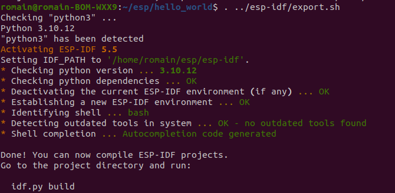
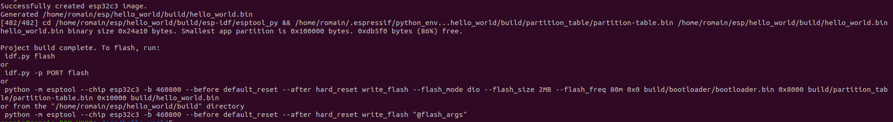
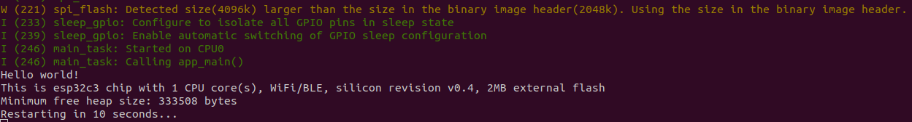
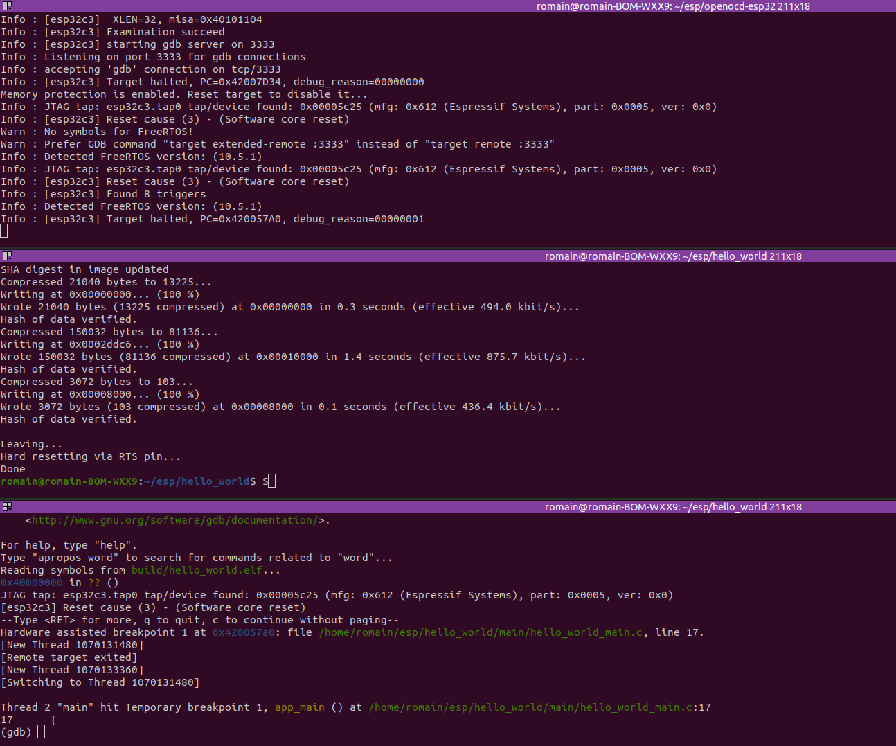

# Utilisation du débogueur sur ESP32C3

## Introduction

Cette documentation explique comment configurer et utiliser le débogueur pour ESP32C3, que ce soit directement dans un terminal ou via Visual Studio Code (VSCode). Les étapes décrites ici ont été testées sur Ubuntu 22.04. L'objectif est de permettre un débogage efficace, que vous utilisiez ou non un environnement graphique.


> **Note** : Une installation et une configuration depuis un terminal permettent également de faciliter la mise en place d'une intégration et d'un déploiement continus (CI/CD) via Docker. Cela garantit un environnement reproductible et automatisé pour vos projets.


## Prérequis

Avant de commencer, assurez-vous d'avoir les éléments suivants :

1. **Matériel** :
   - Une carte ESP32C3.
   - Les câbles nécessaires pour connecter l'adaptateur JTAG à la carte ESP32C3.
   - Un câble Dupont femelle / femelle.

1. **Permissions** :
   - Les droits nécessaires pour accéder aux périphériques USB (groupe plugdev)
   - Les droits nécessaires pour accéder aux ports séries (groupe dialout)

1. **Dépendances supplémentaires** :
   - Python 3.x.

Les outils ESP-IDF et OpenOCD seront installés dans les étapes suivantes de cette documentation.

## Vérification et installation de Python 3

1. Ouvrez un terminal et exécutez la commande suivante pour vérifier la version de Python par défaut sur votre système :  
   `python --version`.  
   Si la sortie est quelque chose comme `Python 2.7.17`, cela signifie que votre interpréteur par défaut est Python 2.7.

2. Vérifiez si Python 3 est déjà installé en exécutant la commande suivante :  
   `python3 --version`.  
   Si cette commande retourne une erreur, cela signifie que Python 3 n'est pas installé sur votre système.

## Installation de la toolchain

1. Installez les dépendances nécessaires en exécutant la commande suivante dans un terminal :  
   `sudo apt-get install git wget flex bison gperf python3 python3-pip python3-venv cmake ninja-build ccache libffi-dev libssl-dev dfu-util libusb-1.0-0`.

2. Téléchargez le framework ESP-IDF en clonant son dépôt Git officiel. Créez un répertoire nommé `esp`, accédez-y, puis exécutez la commande suivante :  
   `git clone --recursive https://github.com/espressif/esp-idf.git`.

3. Accédez au répertoire `esp-idf` et exécutez le script `install.sh` pour installer les outils nécessaires. Spécifiez la cible `esp32c3` comme argument :  
   `./install.sh esp32c3`.

4. Une fois l'installation terminée, activez l'environnement ESP-IDF en exécutant le script `export.sh` :  
   `. ./export.sh`.

5. Pour vérifier que l'installation a été effectuée correctement, exécutez la commande suivante :  
   `idf.py --version`.  
   Vous devriez voir une sortie indiquant la version d'ESP-IDF installée, par exemple : `ESP-IDF v5.0`.

---

## Compilation et Flash d'un Exemple

1. Créez un projet basé sur un exemple fourni avec ESP-IDF. Copiez le répertoire `hello_world` dans votre répertoire de travail et accédez-y.

```bash
cp -r $IDF_PATH/examples/get-started/hello_world . # Il sera nécessaire d'avoir sourcé l'environnement en amont
```



2. Configurez le projet en définissant la cible sur `esp32c3`.

```bash
idf.py set-target esp32c3
```

3. Compilez le projet en exécutant la commande `idf.py build`.



4. Flashez le projet sur votre carte ESP32C3 en exécutant la commande `idf.py flash`.

5. Une fois le flash terminé, ouvrez le moniteur série pour voir la sortie de votre programme en exécutant la commande `idf.py monitor`.  
   Pour quitter le moniteur série, utilisez la combinaison de touches `Ctrl+]`.



## Installation d'OpenOCD

Pour installer OpenOCD, suivez les étapes décrites dans la [documentation officielle](https://docs.espressif.com/projects/esp-idf/en/v3.3.4/api-guides/jtag-debugging/building-openocd-linux.html) :

Assurez-vous d'installer les dépendances nécessaires en exécutant la commande suivante :  
`sudo apt-get install make libtool pkg-config autoconf automake texinfo libusb-1.0-0`.

1. Clonez le dépôt OpenOCD modifié pour ESP32 :

```bash
git clone --recursive https://github.com/espressif/openocd-esp32.git
```

2. Accédez au répertoire cloné :

```bash
cd openocd-esp32
```

3. Configurez et compilez OpenOCD :

```bash
./bootstrap
./configure
make
```

4. Installez OpenOCD sur votre système :

```bash
sudo make install
```

5. Vérifiez que l'installation a réussi en exécutant la commande suivante :

```bash
openocd --version
```

Vous devriez voir une sortie indiquant la version d'OpenOCD installée.

## Configuration de l'interface JTAG on-board de l'ESP32

Pour permettre à OpenOCD d'accéder aux périphériques USB sans nécessiter de privilèges root, ajoutez les règles udev suivantes :

```bash
curl -fsSL https://raw.githubusercontent.com/espressif/openocd-esp32/master/contrib/60-openocd.rules | sudo tee /etc/udev/rules.d/60-openocd.rules
sudo service udev restart
```

Ces commandes téléchargent et installent les règles udev nécessaires, puis redémarrent le service udev pour appliquer les modifications.

## Run OpenOCD

Vous devez lancer le serveur OpenOCD en indiquant que la cible est un ESP32-C3. Pour cela, accédez au répertoire openocd-esp32 dans votre dossier esp et exécutez la commande suivante :

```bash
openocd -f board/esp32c3-builtin.cfg -c "gdb_memory_map disable"
```
Si tout se passe bien, OpenOCD devrait être en attente de connexion GDB sur le port 3333. Vous pouvez maintenant lancer GDB pour déboguer votre programme. 


## Lancement du Débogueur

Pour lancer le débogueur, vous devez d'abord créer un fichier de configuration minimal pour GDB nommé `gdbinit` dans le répertoire `~/esp/blink_led` avec le contenu suivant :

```gdb
target remote :3333
set remote hardware-watchpoint-limit 2
mon reset halt
maintenance flush register-cache
thb app_main
c
```

Ensuite, lancez simplement GDB avec le nom du fichier exécutable au format ELF :

```bash
riscv32-esp-elf-gdb -x gdbinit build/blink_led.elf
```




## Ressources supplémentaires

- Consultez la [documentation officielle ESP-IDF](https://docs.espressif.com/projects/esp-idf/en/latest/esp32c3/index.html) pour plus de détails.
- Accédez au [dépôt GitHub ESP-IDF](https://github.com/espressif/esp-idf) pour les dernières mises à jour.
