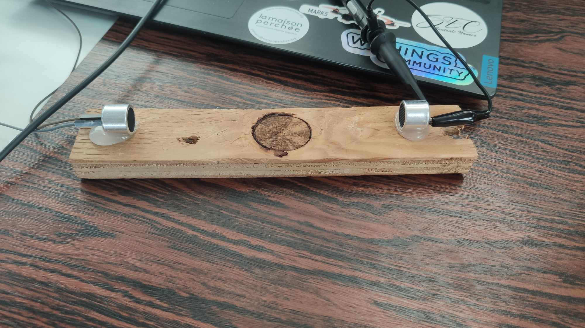
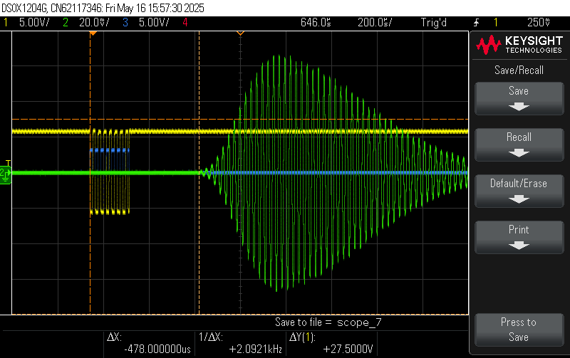
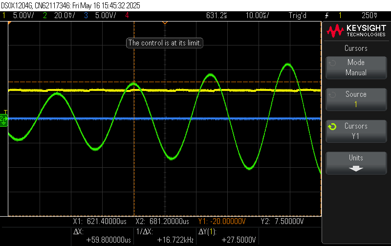
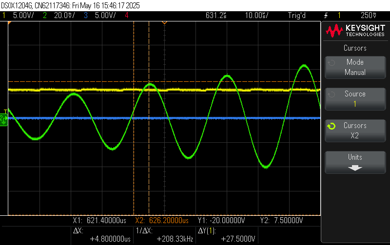
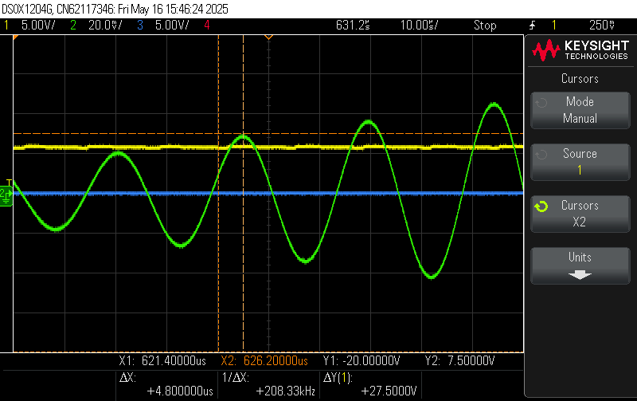

# Influence du vent sur le déphasage d’un signal acoustique

## Introduction

La mesure de la direction et de la vitesse du vent est un enjeu important pour de nombreux systèmes embarqués, notamment dans le domaine de la robotique autonome. Une méthode consiste à analyser l’influence du vent sur la propagation d’un signal acoustique. En effet, la vitesse du vent modifie la vitesse apparente du son dans l’air, ce qui se traduit par une variation du temps de propagation et donc un déphasage du signal reçu.  
Ce document présente les principes physiques, les calculs théoriques et les résultats expérimentaux obtenus lors de l’étude de ce phénomène, dans le cadre d’un projet de girouette électronique.

## Paramètres connus

- **Distance de propagation** :  
  $d = 0.15m$

- **Fréquence du signal** :  
  $f = 40KHz$

- **Vitesse du son dans l'air (sans vent)** :  
  $v_{son} \approx 343 m/s$

- **Longueur d'onde** :  
  $\lambda = \frac{v_{son}}{f} = \frac{343}{40000} \approx 0.008575m$

- **Vitesse du vent** :  
  $v_{vent} = 8.33 m/s$   
  (soit 30 km/h, **positif** si dans le sens du son)

---

## Principe

Le **vent modifie la vitesse apparente du son** :

- **Vent dans le sens du son** :

  $v' = v_{son} + v_{vent}$

- **Vent contraire au son** :
  
  $v' = v_{son} - v_{vent}$

Cela modifie le **temps de propagation** et donc le **déphasage** du signal reçu.

---

## Calcul du temps de propagation

### Sans vent

$t_0 = \frac{d}{v_{son}} = \frac{0.15}{343} \approx 437 µs$

### Avec vent favorable (30 km/h, soit 8.33 m/s)

$t_{vent} = \frac{0.15}{343 + 8.33} = \frac{0.15}{351.33} \approx 426µs$

### Différence de temps

$\Delta t = t_0 - t_{vent} \approx (437 - 426) \approx 10.37µs$

---

## Déphasage induit

- **Période du signal à 40 kHz** :  

  $T = \frac{1}{f} = \frac{1}{40\,000} = 25~\mu s = 2.5 \times 10^{-5}~s$

- **Déphasage en radians** :  

  $\Delta \varphi = 2\pi \cdot \frac{\Delta t}{T} = 2\pi \cdot \frac{1.039 \times 10^{-5}}{2.5 \times 10^{-5}} \approx 2,61~rad$

- **Déphasage en degrés** :  
  
  $\Delta \varphi \approx \frac{2.61}{2\pi} \cdot 360^\circ \approx 149^\circ$

---

## Tableau de déphasage selon la vitesse du vent

| Vitesse vent | Vitesse vent (m/s) | Vitesse avec vent (µs) | Delta (µs)          |
|--------------|--------------------|-------------------------|---------------------|
| 10           | 2.77777777777778   | 433.804627249357        | 3.51315700720249    |
| 20           | 5.55555555555556   | 430.347465731591        | 6.97031852496906    |
| 30           | 8.33333333333333   | 426.944971537002        | 10.3728127195579    |
| 40           | 11.1111111111111   | 423.595858173831        | 13.7219260827286    |
| 50           | 13.8888888888889   | 420.298879202989        | 17.0189050535711    |
| 60           | 16.6666666666667   | 417.052826691381        | 20.2649575651789    |
| 70           | 19.4444444444444   | 413.856529736358        | 23.4612545202017    |
| 80           | 22.2222222222222   | 410.708853057499        | 26.6089311990605    |
| 90           | 25                | 407.608695652174        | 29.7090886043859    |
| 100          | 27.7777777777778   | 404.554989511537        | 32.7627947450225    |
| 110          | 30.5555555555556   | 401.546698393813        | 35.7710858627466    |
| 120          | 33.3333333333333   | 398.582816651904        | 38.7349676046554    |
| 130          | 36.1111111111111   | 395.662368112544        | 41.6554161440158    |
| 140          | 38.8888888888889   | 392.784405004364        | 44.5333792521956    |
| 150          | 41.6666666666667   | 389.948006932409        | 47.3697773241508    |

---

## Résultats

Pour commencer, temps de propagation du signal entre un E/R à 15cm.

Ici, le temps de propagation du signal apres un burst de 8 fronts à 40KHz.

Nous avons un Delta temps de 478µs contre 437µs théorique. 
Un résultat peu choquant car les 15 cm des E/R ne sont pas super rigoureux.

Maintenant, mesurons l'impact du vent sur le temps de reception de notre signal (vent dans le sens contraire du sens de propagation du signal).

Nous remarquons que notre signal a bien été retardé. Cependant, il n'a été retardé que de 4µs.

Nous estimons le vent avec le ventilateur à fond autour de 60 km/h (voir plus!). Le delai temps attendu est donc de 20µs contre 4µs en pratique.

Plus dérangeant, ce résultat est similaire lorsque nous avons un vent de côté.

Ces résultats ne nous permettent pas d'estimer la direction du vent.
