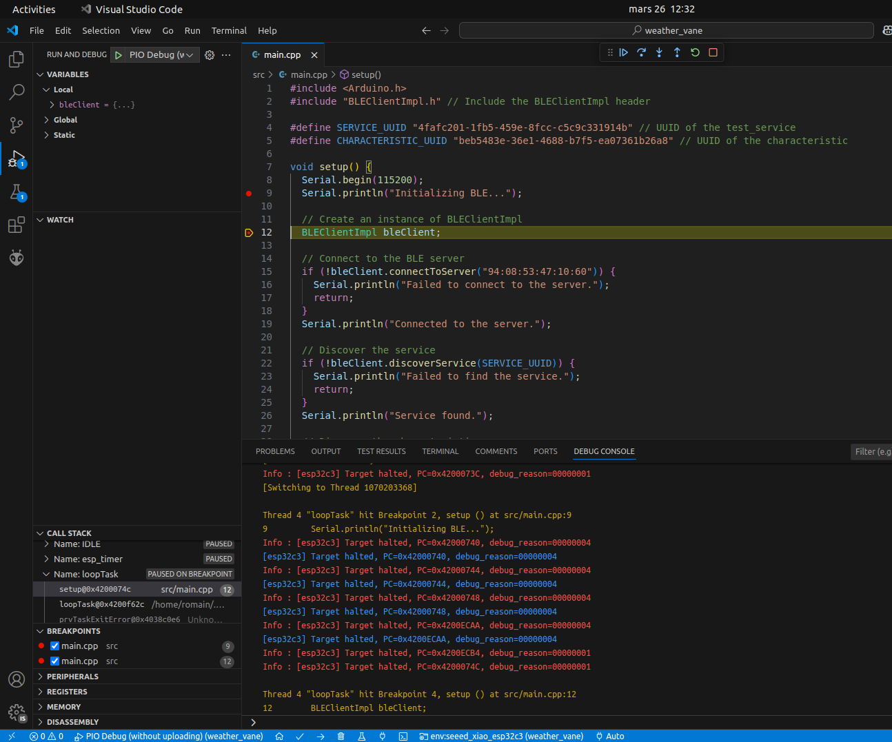

# Configuration de Visual Studio Code pour ESP32-C3

## Introduction

Cette documentation explique comment configurer Visual Studio Code pour le développement et le débogage avec ESP32-C3 en utilisant PlatformIO. Les étapes décrites ici vous guideront pour installer les extensions nécessaires, configurer votre environnement et créer un premier projet.

---

## Prérequis

Avant de commencer, assurez-vous d'avoir les éléments suivants :

1. **Visual Studio Code** : Téléchargez et installez Visual Studio Code depuis [le site officiel](https://code.visualstudio.com/).
2. **Extension PlatformIO** : Installez l'extension PlatformIO IDE depuis le marketplace de Visual Studio Code.
3. **Python 3.x** : Assurez-vous que Python 3 est installé sur votre système.

---

## Création d'un premier projet avec PlatformIO

Pour créer un premier projet avec PlatformIO pour ESP32-C3, suivez les étapes décrites dans [ce tutoriel](https://tutoduino.fr/visual-studio-platformio-pico/). Bien que le tutoriel soit basé sur le Raspberry Pi Pico, les étapes sont similaires pour ESP32-C3. Voici un résumé adapté pour ESP32-C3 :

1. **Ouvrir PlatformIO** :
   - Lancez Visual Studio Code.
   - Cliquez sur l'icône PlatformIO dans la barre latérale gauche.

2. **Créer un nouveau projet** :
   - Cliquez sur "New Project".
   - Donnez un nom à votre projet (par exemple, `esp32c3_project`).
   - Sélectionnez la carte ESP32-C3 dans la liste des cartes disponibles.
   - Choisissez le framework `Arduino`.

3. **Configurer le projet** :
   - Une fois le projet créé, ouvrez le fichier `platformio.ini` dans le répertoire du projet.
   - Vérifiez que la configuration correspond à votre carte ESP32-C3. Par exemple :

     ``` bash
     [env:esp32c3]
     platform = espressif32
     board = esp32c3
     framework = arduino
     ```

4. **Compiler et téléverser** :
   - Cliquez sur l'icône "Build" dans la barre d'outils PlatformIO pour compiler le projet.
   - Connectez votre carte ESP32-C3 à votre ordinateur via USB.
   - Cliquez sur "Upload" pour téléverser le programme sur la carte.

5. **Ouvrir le moniteur série** :
   - Cliquez sur "Monitor" pour ouvrir le moniteur série et voir les sorties de votre programme.

---

## Configuration pour le débogage

Pour activer le débogage avec PlatformIO, vous devez modifier le fichier `platformio.ini` de votre projet afin d'ajouter les paramètres nécessaires. Voici un exemple de configuration pour ESP32-C3 :

``` bash
[env:esp32c3]
platform = espressif32
board = esp32c3
framework = arduino
build_type = debug
debug_tool = esp-builtin
debug_server =
  /usr/local/bin/openocd
  -f
  board/esp32c3-builtin.cfg
```

### Explications des paramètres

- **`build_type = debug`** : Configure le projet pour inclure les symboles de débogage.
- **`debug_tool = esp-builtin`** : Utilise l'outil de débogage intégré pour ESP32-C3.
- **`debug_server`** : Spécifie le chemin vers OpenOCD et le fichier de configuration pour ESP32-C3.

---

## Lancer le mode débogage

Une fois la configuration terminée, vous pouvez lancer le mode débogage dans PlatformIO. Voici les étapes :

1. **Flasher le programme** :
   - Avant de lancer le débogage, assurez-vous que le programme est téléversé sur la carte ESP32-C3. Cliquez sur "Upload" dans la barre d'outils PlatformIO.

2. **Lancer le débogage** :
   - Cliquez sur l'icône "Debug" dans la barre latérale gauche de Visual Studio Code.
   - Sélectionnez l'option **"Debug without uploading"** pour démarrer le débogage sans téléverser à nouveau le programme.

3. **Déboguer votre programme** :
   - Une fois le débogueur lancé, vous pouvez définir des points d'arrêt, inspecter les variables, et exécuter votre programme pas à pas.




## Lancer les tests unitaires

PlatformIO permet d'exécuter facilement des tests unitaires pour vos projets ESP32-C3. Voici les étapes pour configurer et lancer vos tests unitaires :

## Ajouter des tests à votre projet

1. Créez un dossier `test` à la racine de votre projet PlatformIO (s'il n'existe pas déjà).
2. À l'intérieur du dossier `test`, créez un sous-dossier pour chaque suite de tests. Par exemple, créez un dossier `test_example`.
3. Dans ce dossier, ajoutez un fichier `test_main.cpp` contenant vos tests unitaires. Voici un exemple de fichier de test :

   ```cpp
   #include <Arduino.h>
   #include <unity.h>

   void test_led_builtin_pin_number(void) {
       TEST_ASSERT_EQUAL(2, LED_BUILTIN);
   }

   void setup() {
       UNITY_BEGIN(); // Commencez les tests
       RUN_TEST(test_led_builtin_pin_number);
       UNITY_END(); // Terminez les tests
   }

   void loop() {
       // Laissez vide pour les tests unitaires
   }

Il est possible de visualiser le résultat des tests dans l'onglet "Testing"


## Ressources supplémentaires

- [Documentation officielle PlatformIO](https://docs.platformio.org/)
- [Documentation officielle ESP-IDF](https://docs.espressif.com/projects/esp-idf/en/latest/esp32c3/index.html)
- [Tutoriel PlatformIO pour Raspberry Pi Pico](https://tutoduino.fr/visual-studio-platformio-pico/)
