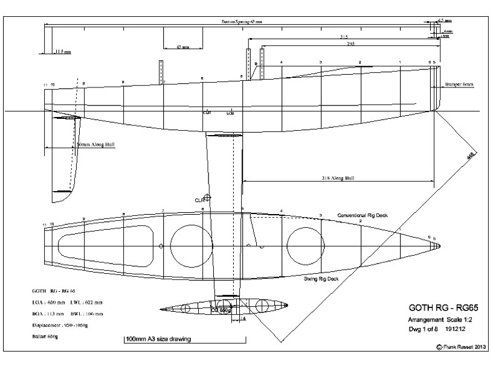
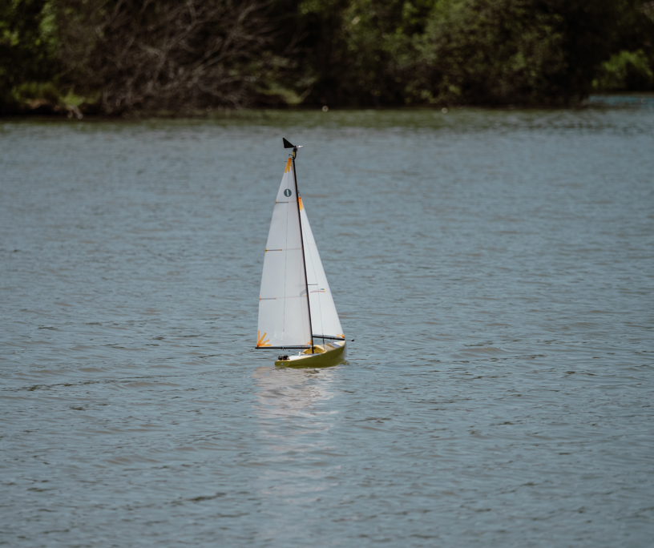
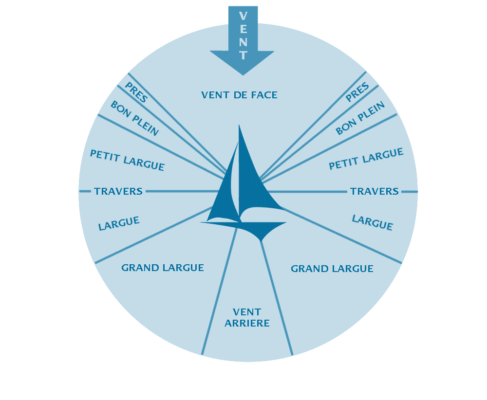
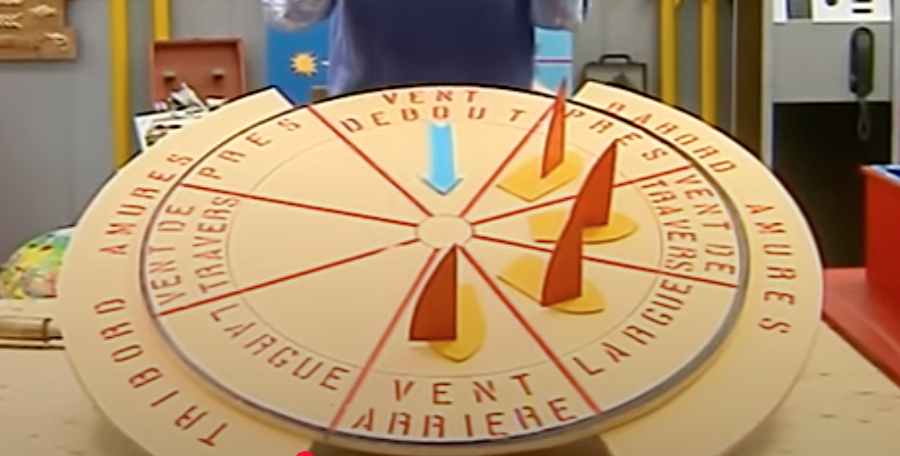
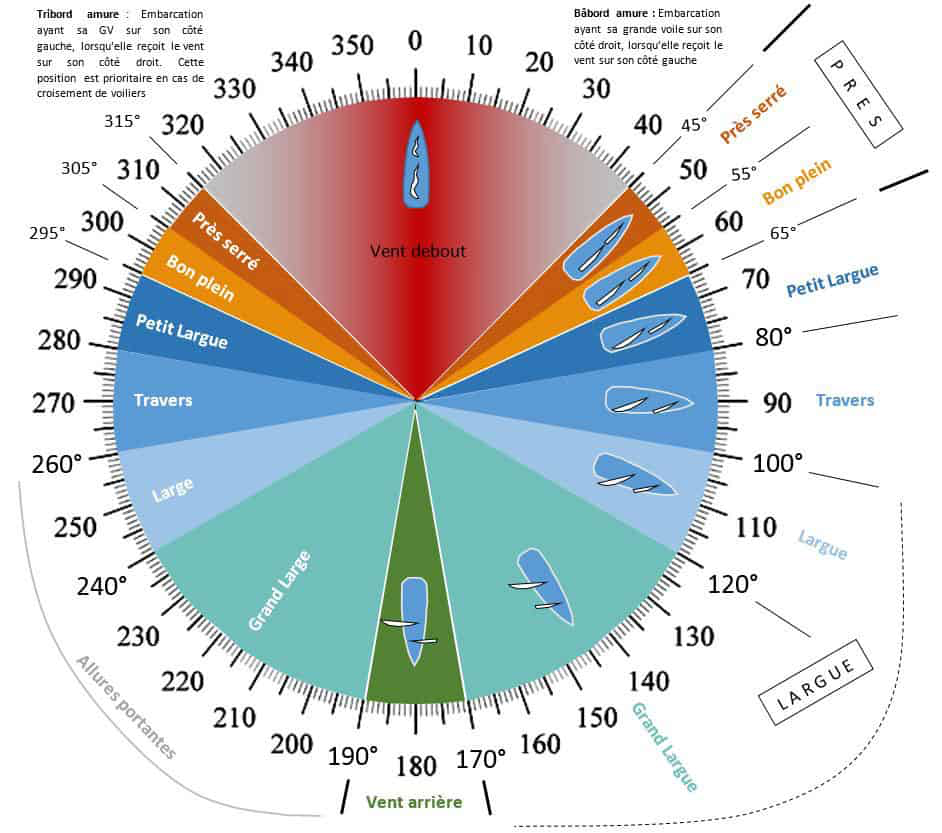

# Piloter la trajectoire d’un voilier

Sources documentaires qui permettront d’établir les caps à suivre.

Figure 1 : coque du voilier (bateau lavoir)

Figure 2 : bateau lavoir en action

## Allures en voile

Figure 3 : Les allures en voile

Figure 4 : Les allures en voile

Figure 5 : allures de voile avec positions de la voile.

Il est possible de remonter le vent, c’est a dire avancer dans la direction du vent (vent de face). Pour ce faire il faut se déplacer en louvoyant (direction près bâbord, puis direction près tribord).  

## Vent

Différent type de vent sont “mesurables” via les données capteurs que nous pourrons recevoir. 

### Vent réel

Vent de la météo

### Vent vitesse

Vent créer par l’avancement du voilier.

### Vent apparent

Combinaison du vent réel et vent vitesse.

Vent apparent = vent réel + vent vitesse 

Un bateau n’avance jamais tout droit sauf quand il est vent arrière, dans tous les autres cas, il avance en crabe 🦀 Il faut donc adapter notre cap pour prendre en compte la dérive. (Je ne sais pas trop si c’est nous qui prenons ça en compte). La dérive est angle qui faut ajouter/soustraire en fonction du vent pour prendre en compte cet “écart” physique qui se produit en avançant.

## Nord magnétique et nord cardinal

Le nord géographique est le "nord fixe" utilisé pour les cartes, tandis que le nord magnétique est celui que votre boussole suit, et il peut se déplacer légèrement chaque année.

## Ce que l’on doit faire

Donner une consigne d’ouverture de voile en fonction du vent réel. 

Idée ⇒ voile fermée ⇒ 0

voile ouverte ⇒ 100

## Ce qu’il faut voir comment faire

Comment manipuler le safran pour virer de bord

https://pmc.ncbi.nlm.nih.gov/articles/PMC7146235/

## Sources utilisées

https://www.youtube.com/watch?v=x6Hn9yyIGx8

https://www.youtube.com/watch?v=L4JBaZY3A28

https://truesailor.com/apprendrelavoile/coursdevoile/manoeuvresvoilier/les-allures.php