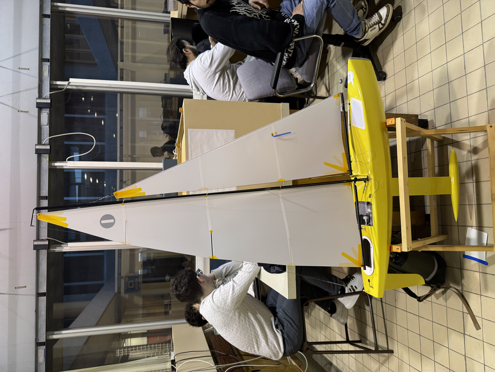

# Détails du voilier

Mat : 120

Hauteur grande voile : 118

Largueur grande voile : 35

30+31+30+29

Petite voile

90 hauteur 

34 en bas la 

98 à droite

Safran

22 hauteur

6 en bas la

17 à droite 

Quille

Hauteur 32

Largeur 8

Largeur coque 16

Hauteur coque 13

**What We Have (From the IOM Class Rules)**

### **1. Geometry & Mass**

- **Boat Length (LOA):** 1.0 m
- **Draft:** 370–420 mm
- **Hull Depth:** ≥ 60 mm
- **Boat Weight:** ≥ 4 kg
- **Keel Weight:** 2200–2500 g
- **Rudder Weight:** ≤ 75 g

### **2. Sail Dimensions (For My B-Rig Mainsail)**

- **Leech Length:** 1200–1210 mm
- **Foot Length:** 340–350 mm
- **Headsail (B-rig)**:
    - **Luff Length:** 980–990 mm
    - **Foot Length:** 340–350 mm

### **3. Hydrodynamic Constraints**

- **Keel Max Width:** 20 mm
- **Keel & Rudder cannot be connected or articulated**
- **Materials:** Keel/Rudder material density must be ≤ lead (11340 kg/m³)