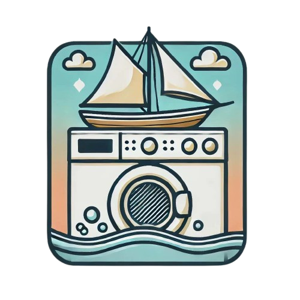

# Plan d’exécution du Projet

```Version 1.1```

```4/12/2024```
```4/12/2024```

## Auteurs
## Auteurs

Bateau Lavoir



|               |               |               |
|---------------|---------------|---------------|
| Romain ASSE   | Adji TOURÉ    | Cédric FERRÉ  |
| Alexis LEQUEUX| Bastien DELFOUILLOUX |        |
| Victor RAVAIN | Baptiste DUBOT|               |
| Amaury LEJOLIVET | Alexis ROSSARD|            |


|               |               |               |
|---------------|---------------|---------------|
| Romain ASSE   | Adji TOURÉ    | Cédric FERRÉ  |
| Alexis LEQUEUX| Bastien DELFOUILLOUX |        |
| Victor RAVAIN | Baptiste DUBOT|               |
| Amaury LEJOLIVET | Alexis ROSSARD|            |

## 1. Équipe

```Liste des membres de l'équipe. Listing des compétences de chaque membres de l’équipe et mise en avant des points différenciants de chacun.```
```Liste des membres de l'équipe. Listing des compétences de chaque membres de l’équipe et mise en avant des points différenciants de chacun.```

* RAS : Git, Linux, Applicatif Linux C et C++, Python, Gitlab (forge & CI), C (MCU)
* ATO : Linux, C++, Yocto, intégration de capteurs, Git.
* RAS : Git, Linux, Applicatif Linux C et C++, Python, Gitlab (forge & CI), C (MCU)
* ATO : Linux, C++, Yocto, intégration de capteurs, Git.
* CFE : Linux, C++, Git, Méthodes agiles


* ALEQ : C++, Python, Excel, Jira, gestion de projet
* BDE : Linux Embarqué, Python, C++, IA Embarquée, Architecture Logicielle, QT, IOT

* VRA : Linux, Git, IA, python, cuda
* BDU : Python, ROS

* ALEJ : C++, Méthodes agiles, Management, électronique.
* ARO : Electronique, intégration de capteurs, LabView, C++, Git, Gestion de projet.

```Identifiez un membre pour chaque période qui aura la charge de s’assurer de la bonne avancée du projet (ce n’est pas le chef de projet, mais plus un « coach » qui s’assurera que l’équipe fonctionne bien). Ce coach doit être différent à chaque période.```

* ALEQ : C++, Python, Excel, Jira, gestion de projet
* BDE : Linux Embarqué, Python, C++, IA Embarquée, Architecture Logicielle, QT, IOT

* VRA : Linux, Git, IA, python, cuda
* BDU : Python, ROS

* ALEJ : C++, Méthodes agiles, Management, électronique.
* ARO : Electronique, intégration de capteurs, LabView, C++, Git, Gestion de projet.

```Identifiez un membre pour chaque période qui aura la charge de s’assurer de la bonne avancée du projet (ce n’est pas le chef de projet, mais plus un « coach » qui s’assurera que l’équipe fonctionne bien). Ce coach doit être différent à chaque période.```

Période 13/01/25 au 7/02/25 : RAS
Période 10/03/25 au 4/04/25 : CFE
Période 05/05/25 au 28/05/25 : ALEJ
Période 13/01/25 au 7/02/25 : RAS
Période 10/03/25 au 4/04/25 : CFE
Période 05/05/25 au 28/05/25 : ALEJ

## 2. État du projet

### 2.1. Sous-projet : Girouette

Alexis ROSSARD - Amaury LEJOLIVET

#### 2.1.1. Description du produit

Réaliser une girouette autonome en énergie et sans fil, documentée et ouverte.
Réaliser une girouette autonome en énergie et sans fil, documentée et ouverte.

#### 2.1.2. Fonctionnalités

Remontée de données anémométriques (puissance, orientation) à une fréquence de 10Hz (100ms).
Remontée de données anémométriques (puissance, orientation) à une fréquence de 10Hz (100ms).

#### 2.1.3. Exigences opérationnelles

Remonter un ensemble de données puissance + orienation du vent toutes les 100ms.
Remonter un ensemble de données puissance + orienation du vent toutes les 100ms.

#### 2.1.4. Plan de validation

```Définissez votre plan de validation du produit pour démontrer que le produit répond bien aux attentes du client. Vous devez définir les procédures de test et les démonstrations d’usage prévus pour valider les exigences définies avant.```
```Définissez votre plan de validation du produit pour démontrer que le produit répond bien aux attentes du client. Vous devez définir les procédures de test et les démonstrations d’usage prévus pour valider les exigences définies avant.```

Être capable de remonter les données anémométriques sans interruption pendant 30 minutes.
Être capable de remonter les données anémométriques sans interruption pendant 30 minutes.

### 2.2. Sous-projet : Système de calcul de position & attitude du bateau

Romain ASSE - Adji TOURÉ - Cédric FERRÉ

#### 2.2.1. Description du produit

Une fois fini, le produit devra permettre de connaitre à tout instant des information de position, de vitesse, d'accélération ainsi que d'orientation du bateau.

#### 2.2.2. Fonctionnalités

```Description des différentes fonctionnalités du produit :```

1. Remontée de position GPS via GPS-RTK (https://www.u-blox.com/en/product/zed-f9p-module) .
1. Remontée de données de vitesse et d'accélération via IMU.
1. Remontée de dérive par rapport au nord magnétique via boussole.
```Description des différentes fonctionnalités du produit :```

1. Remontée de position GPS via GPS-RTK.
1. Remontée de données de vitesse et d'accélération via IMU.
1. Remontée de dérive par rapport au nord magnétique via boussole.

```Priorisation des fonctionnalités par ordre d’importance pour le produit :```

```Priorisation des fonctionnalités par ordre d’importance pour le produit :```

1. Position GPS
1. Vitesse & Accélération
1. Dérive par rapport au nord magnétique
1. Vitesse & Accélération
1. Dérive par rapport au nord magnétique

Référence GPS : ZED-F9P-05B
DataSheet : https://content.u-blox.com/sites/default/files/documents/ZED-F9P-05B_DataSheet_UBXDOC-963802114-12824.pdf

#### 2.2.3. Exigences opérationnelles

1. La position GPS du bateau devra être remontée sur une ihm à une fréquence minimum de 30Hz.
1. Les données de vitesse et d'accélération devront être remontées sur une ihm à une fréquence minimum de 30Hz.
1. L'orientation du bateau par rapport au nord magnétique devra être remontée sur une ihm à une fréquence minimum de 30Hz.
1. La position GPS du bateau devra être remontée sur une ihm à une fréquence minimum de 30Hz.
1. Les données de vitesse et d'accélération devront être remontées sur une ihm à une fréquence minimum de 30Hz.
1. L'orientation du bateau par rapport au nord magnétique devra être remontée sur une ihm à une fréquence minimum de 30Hz.

#### 2.2.4. Plan de validation

1. Pouvoir communiquer la position GPS sans interruption pendant 30 minutes lors d'un parcours dans une zone de 50 mètres par 50 mètres.
1. Pouvoir remonter les données de vitesse et d'accélération sans interruption pendant 30 minutes lors d'un parcours dans une zone de 50 mètres par 50 mètres.
1. Pouvoir remonter l'orientation du bateau par rapport au nord magnétique sans interruption pendant 30 minutes lors d'un parcours dans une zone de 50 mètres par 50 mètres.
1. Pouvoir communiquer la position GPS sans interruption pendant 30 minutes lors d'un parcours dans une zone de 50 mètres par 50 mètres.
1. Pouvoir remonter les données de vitesse et d'accélération sans interruption pendant 30 minutes lors d'un parcours dans une zone de 50 mètres par 50 mètres.
1. Pouvoir remonter l'orientation du bateau par rapport au nord magnétique sans interruption pendant 30 minutes lors d'un parcours dans une zone de 50 mètres par 50 mètres.

### 2.3. Sous-projet : Conception et test du contrôle du bateau

Victor RAVAIN - Baptiste DUBOT

#### 2.3.1. Description du produit

```Décrivez le produit fini attendu. Montrer clairement quels sont les besoins et comment le produit fini va répondre à ces besoins.```

Le produit fini devra permettre au bateau de naviguer en suivant une trajectoire tout en adaptant la position de la voile pour adapter la vitesse grâce au vent.

#### 2.3.2. Fonctionnalités

```Décrivez les différentes fonctionnalités (nom, description, etc.) de votre produit.```

1. Suivit de trajectoire : Suivre une commande de vitesse et de direction en controlant la barre du bateau.
2. Controle de vitesse : Le bateau devra être capable de controler sa vitesse en modifiant la tension de la voile.
3. Controle Batterie : Assurer la gestion de la batterie.

```Priorisez ces fonctionnalités par ordre d’importance pour le produit.```
```Décrivez les différentes fonctionnalités (nom, description, etc.) de votre produit.```

1. Suivit de trajectoire : Suivre une commande de vitesse et de direction en controlant la barre du bateau.
2. Controle de vitesse : Le bateau devra être capable de controler sa vitesse en modifiant la tension de la voile.
3. Controle Batterie : Assurer la gestion de la batterie.

```Priorisez ces fonctionnalités par ordre d’importance pour le produit.```

#### 2.3.3. Exigences opérationnelles

```Définissez les exigences opérationnelles de votre produit en quantifiant les objectifs à atteindre. Les clients utiliseront ces objectifs pour valider la conformité de votre produit (et votre projet). Organiser cette partie en identifiant de manière unique chaque exigence unitaire.```

1. Précision de la position effective par rapport à la position commandée.
2. Précision du controle de la vitesse.

#### 2.3.4. Plan de validation

```Définissez votre plan de validation du produit pour démontrer que le produit répond bien aux attentes du client. Vous devez définir les procédures de test et les démonstrations d’usage prévus pour valider les exigences définies avant.```
```Définissez votre plan de validation du produit pour démontrer que le produit répond bien aux attentes du client. Vous devez définir les procédures de test et les démonstrations d’usage prévus pour valider les exigences définies avant.```

Faire des tests avec des objectifs de position et de vitesse
Faire des tests avec des objectifs de position et de vitesse

### 2.4. Sous-projet Conception, implémentation, évaluation des méthodes de planification (tâche et trajectoire) du bateau
### 2.4. Sous-projet Conception, implémentation, évaluation des méthodes de planification (tâche et trajectoire) du bateau

Alexis LEQUEUX - Bastien DELFOUILLOUX

#### 2.4.1. Description du produit

Une fois terminée, notre partie permettra de communiquer le trajet que doit suivre le bateau pour aller d'un point A à un point B. Cet itinéraire sera mis à jour de manière continue grâce aux données des capteurs présent à bord.
Une fois terminée, notre partie permettra de communiquer le trajet que doit suivre le bateau pour aller d'un point A à un point B. Cet itinéraire sera mis à jour de manière continue grâce aux données des capteurs présent à bord.

#### 2.4.2. Fonctionnalités

1. Itinéraire à suivre en temps-réel
1. Itinéraire à suivre en temps-réel

#### 2.4.3. Exigences opérationnelles

1. Calcul d'un trajet d'un point A à un point B
1. Ajustement de l'itinéraire en fonction des perturbations
1. Prise en compte des données des capteurs
1. Calcul d'un trajet d'un point A à un point B
1. Ajustement de l'itinéraire en fonction des perturbations
1. Prise en compte des données des capteurs

#### 2.4.4. Plan de validation

1. Génération d'une trajectoire à partir d'un plan de course donné
1. Envoi de valeurs fictives au programme pour simuler des perturbations et voir son adaptation
1. Mise en place d'une IHM pour visualiser le trajet à suivre
1. Génération d'une trajectoire à partir d'un plan de course donné
1. Envoi de valeurs fictives au programme pour simuler des perturbations et voir son adaptation
1. Mise en place d'une IHM pour visualiser le trajet à suivre

## 3. Planning du projet

### 3.1. Jalons et délivrables

```Rappelez les dates importantes du projet (périodes, revues, etc.) et les délivrables attendus : ce document, la documentation finale, code, etc.```

__Documentation complète :__ Cahier des charges, spécifications fonctionnelles et techniques.
Rapport détaillé sur l’intégration et le fonctionnement des différents elements.

__Code source fonctionnel :__ Modules pour la collecte, le traitement et la fusion des données des capteurs.

__Validation technique :__ Preuve que les données des capteurs et que l'utilisation des actionneurs sont conformes au CdC.

__Démonstration en environnement réel :__ Test en situation réelle montrant le bon fonctionnement du systeme.


### 3.2. Planning de la première période

```Pour chaque sous-projet, donnez les objectifs de réalisation sur la première période. Lister les fonctionnalités qui seront opérationnelles à la fin de la période (nom, description) ainsi que leurs tests d’acceptation (autrement dit qu’est-ce qui permettra de dire que la fonctionnalité est réalisée). Attention prenez bien en compte le temps que vous pourrez y consacrer.```

```Pour chaque fonctionnalité, évaluez leur difficulté et durée et décomposer les en tâches à mener pour les réaliser.```

__Objectifs de réalisation pour le sous-projet IMU, boussole et GPS__

L’objectif principal de cette période est de structurer et préparer les bases nécessaires pour le développement et l’intégration des capteurs de position, vitesse et orientation.


1. Rédaction du cahier des charges (CDC).
1. Définition des spécifications fonctionnelles pour la remontée des données GPS, IMU et boussole.
1. Étude approfondie du matériel imposé : modules GPS-RTK, IMU, et boussole.
1. Analyse des travaux des étudiants précédents sur des projets similaires.

Tâches planifiées
1. __Rédaction du cahier des charges (CDC)__  
__Description :__ Formaliser les besoins en termes de localisation, mesure d’accélération, vitesse, et orientation.  
__Tâches à mener :__
    - Définir les exigences pour chaque capteur (précision, fréquence, portée, etc.).
    - Identifier les contraintes liées à l’intégration des capteurs (matériel, logiciel).
    - Lister les critères de validation des données collectées.

2. __Rédaction des spécifications fonctionnelles__  
__Description :__ Traduire les besoins du CDC en spécifications détaillées et mesurables.  
__Tâches à mener :__
    - Décrire les interfaces nécessaires pour intégrer les capteurs (logiciels et matériels).
    - Spécifier les fréquences de remontée des données :
    - Déterminer les protocoles de communication à utiliser (UART, I2C, SPI).

3. __Étude du matériel imposé (GPS, IMU, boussole)__  
__Description :__ Analyser les capteurs disponibles ou imposés pour valider leur pertinence et faisabilité technique.  
__Tâches à mener :__
    - Recueillir la documentation technique pour chaque capteur.
    - Tester les capteurs en conditions contrôlées pour évaluer :
        - Précision des données.
        - Taux de rafraîchissement.
    - Identifier les éventuelles limitations (environnementales, énergétiques).

4. __Analyse des travaux précédents__  
__Description :__ Étudier les projets similaires ayant utilisé des GPS, IMU ou boussoles pour identifier les bonnes pratiques et pièges à éviter.  
__Tâches à mener :__
    - Recueillir les codes sources, schémas et rapports des étudiants précédents.
    - Analyser les stratégies de traitement des données capteurs (fusion de données, corrections).
    - Synthétiser les conclusions sous forme de recommandations.

__Tests d’acceptation__  
1. CDC : Le document est validé par l’équipe encadrante et reflète les attentes en termes de localisation, vitesse, et orientation.
1. Spécifications fonctionnelles : Document validé en interne, garantissant la faisabilité des objectifs définis.
1. Étude du matériel : Rapport synthétique détaillant les performances des capteurs (précision, fréquence, contraintes).
1. Analyse des travaux précédents : Document de synthèse listant les points-clés pour une intégration réussie des capteurs.


### 3.3. Backlog

```Backlog: donner la liste des fonctionnalités (nom, description) qui sont planifiées sur les périodes suivantes (pas besoin de préciser sur quelle période). Donner une priorité à ces fonctionnalités (au cas où il faudrait faire un choix).```

__Sous-projet : Girouette__

1. Conception et fabrication d’un prototype fonctionnel
    - Description : Développer une girouette autonome en énergie et capable de transmettre des données de puissance et d’orientation du vent sans fil.
    - Priorité : Très haute.

1. Développement de la communication sans fil
    - Description : Mettre en place un système de transmission fiable des données vers une IHM à une fréquence de 10 Hz.
    - Priorité : Haute.

1. Mise en œuvre d’un système de validation des données transmises
    - Description : Vérifier l’intégrité et la cohérence des données envoyées par la girouette.
    - Priorité : Moyenne.

__Sous-projet : Système de calcul de position & attitude du bateau__

1. Implémentation de la remontée des données GPS
    - Description : Développer un système pour récupérer la position GPS via un module GPS-RTK.
    - Priorité : Très haute.

1. Intégration d’une IMU pour mesurer la vitesse et l’accélération
    - Description : Configurer et calibrer une unité de mesure inertielle pour fournir des données précises.
    - Priorité : Haute.

1. Ajout d’une boussole pour la dérive magnétique
    - Description : Installer un capteur magnétique et développer l’algorithme pour mesurer l’orientation.
    - Priorité : Haute.

__Sous-projet : Contrôle du bateau__

1. Développement du contrôle de trajectoire (barre)
    - Description : Implémenter un algorithme pour suivre une commande de direction.
    - Priorité : Très haute.

1. Développement du contrôle de vitesse (voile)
    - Description : Créer un système permettant d’ajuster la tension de la voile pour maintenir ou ajuster la vitesse.
    - Priorité : Haute.

__Sous-projet : Planification des trajectoires__

1. Calcul initial d’une trajectoire A-B
    - Description : Développer un algorithme capable de planifier un trajet simple en ligne droite entre deux points.
    - Priorité : Très haute.

1. Ajout d’un recalcul dynamique en cas de perturbations
    - Description : Permettre l’adaptation de l’itinéraire en cas de changement des conditions (vent, obstacles).
    - Priorité : Haute.

1. Visualisation du trajet
    - Description : Développer une interface pour afficher l’itinéraire en temps réel.
    - Priorité : Moyenne.

## 4. Management du risque

```Lister les risques (retard, échec, organisation, manque de connaissance, etc.) possible pour les différents sous-projets. Pour chacun proposer les actions à entreprendre pour prévenir le risque et y répondre s'il survient.```

### 4.1 Risques généraux

1. Difficulté à respecter les jalons en raison de tâches sous-estimées.
    - Planification régulière des points d’avancement, définition claire des responsabilités et réaffectation des ressources si nécessaire.
    - Manque de communication entre sous-projets

1. Mauvaise intégration des différentes parties du projet.
    - Organiser des réunions inter-équipes hebdomadaires pour aligner les objectifs et identifier les dépendances critiques.
    - Manque de connaissance technique

1. Défaillance dans la maîtrise d’une technologie ou d’un outil.
    - Planifier des sessions de formation en début de projet et mobiliser des experts internes ou externes en cas de blocage.


### 4.2 Risques spécifiques aux sous-projets

__Sous-projet : Girouette__

1. Données anémométriques erronées ou bruitées
    - Tester les capteurs en laboratoire avant intégration et prévoir un budget pour remplacer les capteurs si nécessaire.

__Sous-projet : Système de calcul de position & attitude__

1. Imprécision des mesures GPS en environnement complexe
    - Tester les équipements en environnement simulé et prévoir des essais sur le terrain dans des conditions variées.

__Sous-projet : Contrôle du bateau__

1. Échec dans la synchronisation entre la voile et la barre
    - Décomposer les tests pour isoler les composants et effectuer des tests unitaires rigoureux avant l’intégration complète.

__Sous-projet : Planification des trajectoires__

1. Temps de calcul trop long pour un recalcul de trajectoire dynamique
    - Optimiser les algorithmes en priorisant les ajustements critiques et simuler les scénarios complexes pour évaluer les performances.